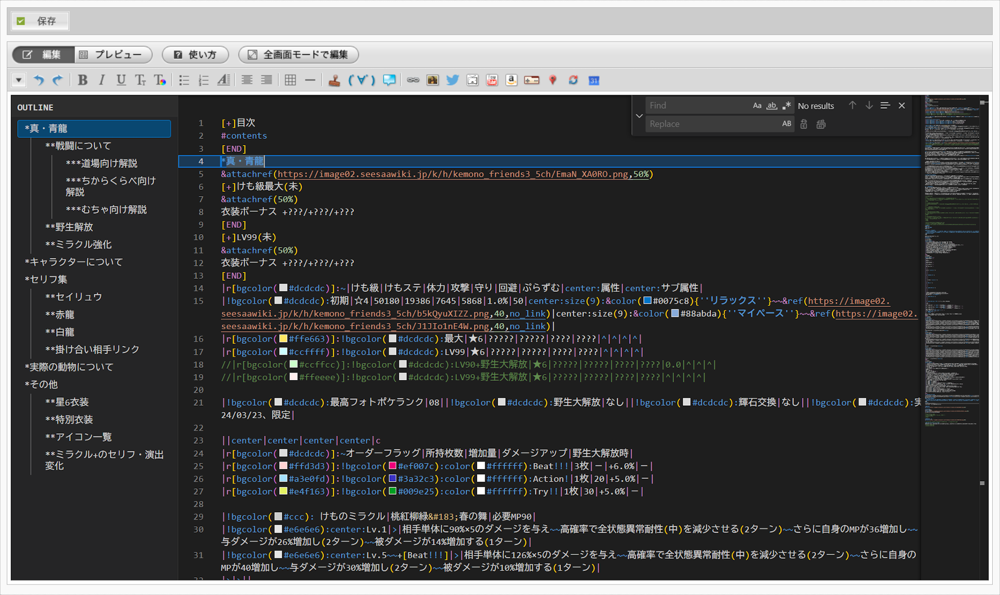

# Seesaa Wiki Enhancer
[Seesaa Wiki](https://wiki.seesaa.jp)の編集機能を[Monaco Editor](https://microsoft.github.io/monaco-editor/)ベースで拡張するUserScriptです。

- [Seesaa Wiki Enhancer](#seesaa-wiki-enhancer)
  - [⚠️注意事項](#️注意事項)
  - [主な機能](#主な機能)
  - [使用方法](#使用方法)
    - [インストール手順詳細](#インストール手順詳細)
    - [更新方法](#更新方法)
    - [使用環境](#使用環境)
  - [キーボードショートカット](#キーボードショートカット)
    - [独自のショートカット一覧](#独自のショートカット一覧)
      - [編集画面](#編集画面)
      - [差分画面](#差分画面)
    - [Monaco Editorの標準ショートカット](#monaco-editorの標準ショートカット)
  - [Snippet一覧](#snippet一覧)
    - [テキスト装飾](#テキスト装飾)
    - [テキスト整形](#テキスト整形)
    - [リンクと参照](#リンクと参照)
    - [画像と添付ファイル](#画像と添付ファイル)
    - [その他の装飾](#その他の装飾)
    - [折りたたみ](#折りたたみ)
    - [その他](#その他)
  - [既知の問題](#既知の問題)
  - [今後実装するかもしれない機能](#今後実装するかもしれない機能)
  - [実装予定のない機能](#実装予定のない機能)

## ⚠️注意事項
**本UserScriptは非公式です。** 
**本UserScriptを使用することにより生じた損害について、作者は一切の責任を負いません。自己責任で使用してください。** 
**本UserScriptを使用することにより何らかの異常が発生した場合、直ちに使用を中止してください。**

## 主な機能
- **[Monaco Editor](https://microsoft.github.io/monaco-editor/)の導入**
  - 編集画面のエディターを、Monaco Editorで置き換えます。これにより、検索・置換機能をはじめとする高度な編集機能が利用可能になります。
- **シンタックスハイライト**
- **アウトライン表示**
  - エディターの横に見出しの一覧がツリー表示され、クリックするとその見出しにジャンプできます。
- スマートペースト機能
    - `Ctrl+Shift+V`で画像、動画、音声、YouTube、ニコニコ、Twitter、その他URLをwiki記法で貼り付けます。
- キーボードショートカット
- Snippet機能
- その他
  - 画像URLホバーでプレビュー表示
  - リンクのCtrl+クリックでリンクを開く/アンカーにジャンプ
  - 差分画面で変更点へジャンプ
  - 編集時のエディターのサイズを大きくする
  - …など

## 使用方法
Tampermonekyで使用してください。
### インストール手順詳細
1. [Tampermonkey](https://www.tampermonkey.net)をインストールする
2. [最新のRelease](https://github.com/reamkf/seesaawiki-enhancer/releases/latest)の`seesaawiki-enhancer.user.js` [[直リンク]](https://github.com/reamkf/seesaawiki-enhancer/releases/latest/download/seesaawiki-enhancer.user.js) をクリックする
3. Tampermonkeyのインストール画面が表示されるので、インストールをクリックする

※ブラウザの開発者モードを有効化する必要がある可能性があります。詳しくは[こちら](https://www.tampermonkey.net/faq.php?locale=ja#Q209)を参照

### 更新方法
Tampermonkeyの更新機能に対応しているため、Tampermonkeyの自動更新機能を用いる(推奨)か、スクリプト設定画面から更新を行ってください。

### 使用環境
- Tampermonekyで使用してください。
- ブラウザはChromium系(Google Chrome, Microsoft Edge等)を推奨します。それ以外のブラウザでの動作は確認していません。
- PC版のみ対応します。モバイル版では動作しません。

## キーボードショートカット
### 独自のショートカット一覧
#### 編集画面

| ショートカット | 機能 |
|----------------|------|
| `Ctrl+Shift+V` | 画像、動画、音声、YouTube、ニコニコ、Twitter、その他URLをwiki記法で貼り付け |
| `Ctrl+B` | 太字を挿入 |
| `Ctrl+U` | 下線を挿入 |
| `Ctrl+K` | リンクを挿入 |
| `Ctrl+D` | 打ち消し線を挿入 |
| `Ctrl+I` | 斜体を挿入 |
| `Esc` | ファイル検索等のウィンドウを閉じる |
| `Enter` | • 箇条書き記法/引用記法を新しい行に自動追加。さらに`Enter`を押すと記法を削除 • 表の途中の場合、次の行の同じ列のセルへ移動 • ファイル検索のフォーム送信を実行 |
| `Tab` | • 箇条書きの階層を下げる • 表の右のセルへ移動 |
| `Shift+Enter` | `Enter`の逆の動作 |
| `Shift+Tab` | `Tab`の逆の動作 |

#### 差分画面

| ショートカット | 機能 |
|----------------|------|
| `Alt+↓` | 次の変更点へジャンプ |
| `Alt+↑` | 前の変更点へジャンプ |

### Monaco Editorの標準ショートカット
…のうち、特におすすめのもの

| ショートカット | 機能 |
|----------------|------|
| `Ctrl+F` | 検索 |
| `Ctrl+H` | 置換 |
| `Ctrl+Shift+O` | シンボル一覧を検索してジャンプ |
| `Ctrl+/` | 行をコメントアウト/コメントアウト解除 |
| `Alt+↓` | 行を下に移動 |
| `Alt+↑` | 行を上に移動 |
| `Alt+Shift+↓` | 行を下にコピー |
| `Alt+Shift+↑` | 行を上にコピー |

  <!-- - 編集画面
    - `Ctrl+B`: 太字を挿入
    - `Ctrl+U`: 下線を挿入
    - `Ctrl+K`: リンクを挿入
    - `Ctrl+D`: 打ち消し線を挿入
    - `Ctrl+I`: 斜体を挿入
    - `Esc`: ファイル検索等のウィンドウを閉じる
    - `Enter`:
      - 箇条書き記法/引用記法を新しい行に自動追加。さらに`Enter`を押すと記法を削除
      - 表の途中の場合、次の行の同じ列のセルへ移動
      - ファイル検索のフォーム送信を実行
    - `Tab`:
      - 箇条書きの階層を下げる
      - 表の右のセルへ移動
    - `Shift+Enter`, `Shift+Tab`: `Enter`, `Tab`の逆の動作
  - 差分画面
    - `Alt+↓`: 次の変更点へジャンプ
    - `Alt+↑`: 前の変更点へジャンプ

### Monaco Editorの標準で用意されているショートカット
…のうち、特におすすめのもの
- `Ctrl+F`, `Ctrl+H`: 検索/置換
- `Ctrl+Shift+O`: シンボル一覧を検索してジャンプ
- `Ctrl+/`: 行をコメントアウト/コメントアウト解除
- `Alt+↓`, `Alt+↑`: 行を上/下に移動
- `Alt+Shift+↓`, `Alt+Shift+↑`: 行を上/下にコピー -->

## Snippet一覧
エディタ内でSnippetのキーワードを入力すると、キーワードに一致するSnippetの候補が表示されます。
候補を`↑` `↓`で選んで、`Tab`か`Enter`で確定すると、対応するテキストが挿入されます。

### テキスト装飾

| キーワード | 説明 | 挿入テキスト |
|------------|------|--------|
| `bold` | 太字 | `''太字テキスト''` |
| `italic` | イタリック体 | `'''イタリック体テキスト'''` |
| `underline` | 下線 | `%%%下線付きテキスト%%%` |
| `deleted` | 取り消し線 | `%%取り消し線付きテキスト%%` |
| `strikethrough` | 取り消し線 | `%%取り消し線付きテキスト%%` |
| `&sup` | 上付き文字 | `&sup{上付き文字}` |
| `&sub` | 下付き文字 | `__下付き文字__` |
| `&ruby` | ルビ | `&ruby(ルビ){ルビを振る文字}` |

### テキスト整形

| キーワード | 説明 | 挿入テキスト |
|------------|------|--------|
| `&size` | 文字サイズ変更 | `&size(20){大きな文字}` |
| `&color` | 文字色変更 | `&color(red){赤い文字}` |
| `&align` | テキスト配置 | `&align(center){中央揃えテキスト}` |

### リンクと参照

| キーワード | 説明 | 挿入テキスト |
|------------|------|--------|
| `link` | 内部リンク | `[[リンク先]]` |
| `link (with text)` | テキスト付き内部リンク | `[[表示テキスト>リンク先]]` |
| `&aname` | アンカー設定 | `&aname(anchor_name)` |

### 画像と添付ファイル

| キーワード | 説明 | 挿入テキスト |
|------------|------|--------|
| `&ref` | 画像表示 | `&ref(画像URL)` |
| `&attach` | ファイル添付 | `&attach()` |
| `&attachref` | ファイル添付と表示 | `&attachref()` |
| `&video` | 音声表示 | `&video(動画URL){}` |
| `&audio` | 音声表示 | `&audio(音声URL)` |
| `&youtube` | YouTube表示 | `&youtube(URL)` |
| `&niconico` | ニコニコ動画表示 | `&youtube(URL)` |

### その他の装飾

| キーワード | 説明 | 挿入テキスト |
|------------|------|--------|
| `&fukidashi` | 吹き出し | `&fukidashi(){}` |
| `pre-formatted` | 整形済みテキスト | `=\|BOX\|` `整形済みテキスト` `\|\|=` |

### 折りたたみ

| キーワード | 説明 | 挿入テキスト |
|------------|------|--------|
| `plus-end` | 折りたたみ(デフォルトで閉じている) | `[+]タイトル` `内容` `[END]` |
| `minus-end` | 折りたたみ(デフォルトで開いている) | `[-]タイトル` `内容` `[END]` |

### その他

| キーワード | 説明 | 挿入テキスト |
|------------|------|--------|
| `#contents` | 目次 | `#contents` |
| `&twitter` | ツイート表示 | `&twitter(ツイードID)` |
| `&twitter_profile` | Twitterプロフィール表示 | `&twitter(ユーザーID)` |
| `definition` | 定義リスト | `:定義語\|説明文` |
| `annotation` | 注釈 | `((注釈))` |
| `horizon` | 水平線 | `----` |
| `&RecentUpdate` | 最近の更新 | `&RecentUpdate()` |

## 既知の問題
- 元のエディターのツールバーの一部が機能しない
  - → 対応予定なし。snippetなどを活用つつ人力で書いてください
- 表のシンタックスハイライトが効かない場合がある
- ページが大きい場合に途中からシンタックスハイライトやColor Decoratorが効かなくなる
  - → これはMonaco Editorの(デフォルト設定での)仕様です。処理が重くなるのを避けるために、解析する量に上限を設けています。
- `&ref(URL,サイズ)`で`,サイズ`がURLに含まれてしまい、Ctrl+クリックでリンクが開けない
  - → Monaco EditorのデフォルトのURL検出機能によるものです。無効化または上書きできないかそのうち調べます。
- Color PickerでAlpha値が反映されない

## 今後実装するかもしれない機能
- より多くのシンタックスのシンタックスハイライト対応
- 画像コピペアップロード機能
- アンカー名や`no_link`等のCompletion機能
- User snippet機能
- テーマ変更機能
- 一時的に元のエディターに戻す機能
- 差分画面→編集画面へのリンク追加
- アンカーのリネーム機能

## 実装予定のない機能
- Folding Range
  - 実際あんまり使わない割に重くなる気がするので
- ページをまたいだ連携
- リアルタイムプレビュー